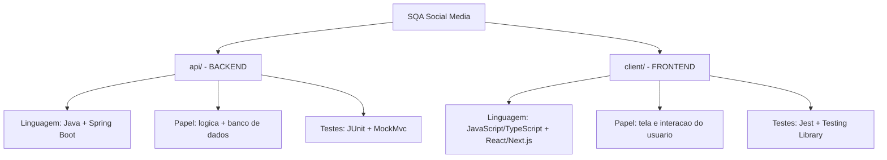

# 🎯 Atividade 4 — Prática de Testes 1

> [!abstract] Resumo em uma frase
> Encontrei **bugs intencionais** num sistema e escrevi **testes automatizados**: alguns que **falham de propósito** (provam que o bug existe) e outros que **passam** (validam o que está correto e protegem contra regressões futuras).

> [!success] Resultado final (tudo já roda)
> - **Backend (JUnit):** 3 testes → ✅ 2 passam, ❌ 1 falha (bug da mensagem)
> - **Frontend (Jest):** 14 testes → ✅ 13 passam, ❌ 1 falha (bug da senha)
> - Os testes **vermelhos são intencionais** — são eles que capturam os bugs.

---

## 1. 🧭 Visão geral do projeto

O sistema "SQA Social Media" tem **duas metades**, cada uma numa linguagem diferente — por isso usei **duas ferramentas de teste diferentes**.



> [!info] Por que duas ferramentas?
> Cada linguagem tem a sua. **JUnit** testa código **Java** (backend); **Jest** testa código **JavaScript** (frontend). Não dá pra usar uma na outra — como chave de fenda em porca.

### Onde fica cada arquivo

| Arquivo do **sistema** (tem o bug ou a lógica) | Arquivo de **teste** (criei eu)                     |
| ---------------------------------------------- | --------------------------------------------------- |
| `client/src/utils/password.ts`                 | `client/src/utils/password.test.ts`                 |
| `client/src/utils/email.ts`                    | `client/src/utils/email.test.ts`                    |
| `client/src/components/PostCard.tsx`           | `client/src/components/PostCard.test.tsx`           |
| `client/src/components/Header.tsx`             | `client/src/components/Header.test.tsx`             |
| `client/src/app/signup/page.tsx`               | `client/src/app/signup/SignUp.integration.test.tsx` |
| `client/src/app/page.tsx` (home)               | `client/src/app/Home.integration.test.tsx`          |
| `api/.../controller/AuthController.java`       | `api/.../controller/AuthControllerTest.java`        |

> [!tip] Regra pra se achar
> O código do sistema e o teste dele ficam **lado a lado**. O arquivo de teste sempre tem **`.test`** no nome (frontend) ou termina em **`Test`** (backend Java).

---

## 2. 🐞 Os dois bugs ()

> [!bug] Bug 1 — Frontend (validação de senha)
> **Arquivo:** `client/src/utils/password.ts` (linha 2)
> ```js
> if (!password || password.length <= 8) {   // ❌ ERRADO
>   return false;
> }
> ```
> **Requisito:** a senha deve ter **no mínimo 8 caracteres** → ou seja, **8 é válido**.
> **O erro:** `<= 8` ("menor ou igual a 8") joga o número **8 no grupo dos rejeitados**. Logo, uma senha de exatamente 8 caracteres é recusada — quando deveria ser aceita.
> **Conserto:** trocar `<= 8` por `< 8` (só rejeita quem tem *menos* que 8).
> **Nome técnico:** erro de limite / *off-by-one* ("errou por um").

> [!bug] Bug 2 — Backend (mensagem de e-mail duplicado)
> **Arquivo:** `api/.../controller/AuthController.java` (método `signup`)
> ```java
> .body(new ErrorResponse("E-mail já está em uso", 409));   // ❌ texto errado
> ```
> **Requisito:** quando o e-mail já existe, a mensagem deve ser exatamente **"E-mail já cadastrado"**.
> **O erro:** o código responde **"E-mail já está em uso"** — mesmo sentido, mas **texto diferente do exigido**. O status `409` está **correto**; só o texto diverge.
> **Conserto:** trocar a string para `"E-mail já cadastrado"`.


> [!note] Bug extra que notei (bônus para citar)
> `UserService.isEmailValid` (backend) valida e-mail só com `email.contains("@")`, aceitando endereços malformados como `usuario@`. É uma validação fraca diante do requisito de "e-mail válido". (Não foi testado, mas vale mencionar se sobrar pergunta.)

---

## 3. ☕ Testes de Backend — `AuthControllerTest.java`

> [!quote] Técnica usada
> `@WebMvcTest(AuthController.class)` liga **só a camada web do controller** (sem subir o sistema inteiro nem o banco). O `UserService` é trocado por um **dublê** (`@MockBean`), e o `mockMvc` é a ferramenta que **envia requisições HTTP de teste** e lê as respostas.

### Anatomia do cabeçalho (vale para os 3 testes)

```java
@WebMvcTest(AuthController.class)   // (1) sobe só o controller, sem banco -> rápido e focado
class AuthControllerTest {

  @Autowired
  private MockMvc mockMvc;          // (2) o "carteiro": envia POST/GET de teste e lê a resposta

  @MockBean
  private UserService service;      // (3) dublê do serviço: eu controlo o que ele responde
```

| Peça | O que faz |
| --- | --- |
| `@WebMvcTest(AuthController.class)` | Carrega apenas o controller e a infraestrutura web. Sem banco de dados. |
| `mockMvc` | Simula um cliente/navegador: faz a requisição e devolve a resposta pra eu inspecionar. **Apesar do nome, não é um mock** — é a ferramenta de requisição. |
| `@MockBean UserService service` | Substitui o serviço real por um **dublê controlado**, pra isolar o teste e simular cenários. |

### ✅ Teste 1 — `signup_comDadosValidos_deveRetornar200EUsuarioCriado` (PASSA)

> [!example] Requisito validado
> Cadastro bem-sucedido deve responder **200 OK** com o usuário criado.

```java
when(service.isEmailValid(anyString())).thenReturn(true);    // finjo: e-mail é válido
when(service.isPasswordValid(anyString())).thenReturn(true); // finjo: senha é forte
when(service.findByEmail(anyString())).thenReturn(null);     // finjo: e-mail AINDA NÃO existe
when(service.createUser(anyString(), anyString())).thenReturn(criado); // finjo: criou o usuário

mockMvc.perform(post("/auth/signup")        // mando um POST para a rota de cadastro
        .contentType(MediaType.APPLICATION_JSON)
        .content(body))                      // com o corpo (e-mail + senha) em JSON
    .andExpect(status().isOk())              // ESPERO: status 200
    .andExpect(jsonPath("$.id").value(1))    // ESPERO: a resposta tem id = 1
    .andExpect(jsonPath("$.email").value("novo@email.com"));
```

> [!info] O papel dos `when(...).thenReturn(...)`
> Cada um **programa o dublê**: "quando o controller chamar este método, responda isto". Aqui montei o cenário do **caminho feliz**: e-mail válido, senha forte e — crucial — `findByEmail` retorna **`null`**, ou seja, **o e-mail ainda não existe**. Sem isso, o controller acharia que é duplicado e o cadastro não passaria.

### ✅ Teste 2 — `signin_comCredenciaisInvalidas_deveRetornar401EMensagemCorreta` (PASSA)

> [!example] Requisito validado
> Login com credenciais erradas → **401** + mensagem **"Credenciais inválidas"** (texto literal do enunciado).

```java
when(service.isEmailValid(anyString())).thenReturn(true);
when(service.isPasswordValid(anyString())).thenReturn(true);
when(service.findByEmail(anyString())).thenReturn(null);  // usuário NÃO existe -> credencial inválida

mockMvc.perform(post("/auth/signin")...)
    .andExpect(status().isUnauthorized())                       // ESPERO: status 401
    .andExpect(jsonPath("$.message").value("Credenciais inválidas")); // ESPERO: a mensagem exata
```

### ❌ Teste 3 — `signup_comEmailJaCadastrado_deveExibirMensagemDoRequisito` (FALHA → captura o bug)

> [!failure] Este teste FALHA de propósito
> Ele afirma o comportamento **exigido pelo requisito**. Como o código diverge, a falha **prova o bug**.

```java
when(service.findByEmail(anyString())).thenReturn(existente); // finjo: e-mail JÁ existe

mockMvc.perform(post("/auth/signup")...)
    .andExpect(status().isConflict())                          // ✅ PASSA: status 409 está certo
    .andExpect(jsonPath("$.message").value("E-mail já cadastrado")); // ❌ FALHA: texto diverge
```

> [!tip] Detalhe que vale ponto — duas verificações, resultados diferentes
> - `status().isConflict()` (409) → **passa** (o código acerta o status).
> - verificação da **mensagem** → **falha** (código diz "E-mail já está em uso", requisito exige "E-mail já cadastrado").
> Saída real do erro: `expected:<E-mail já cadastrado> but was:<E-mail já está em uso>`.

---

## 4. ⚛️ Testes de Frontend — Jest + Testing Library

> [!info] Configuração que precisei adicionar
> - `client/jest.setup.ts` → importa `@testing-library/jest-dom` (matchers como `toBeInTheDocument`).
> - `client/jest.config.ts` → ativei o `setupFilesAfterEnv` e adicionei o `moduleNameMapper` para resolver o atalho `@/` (sem isso, o `jest.mock("@/...")` não funcionava).

### 4.1 🧮 Unitários de **função pura**

> [!note] O que é "função pura"
> Uma função que **só recebe um valor e devolve outro** — sem mexer em tela nem em banco. É lógica isolada, tipo uma calculadora.

#### ✅ `email.test.ts`

```js
import { isEmailValid, getEmailValidationMessage } from "./email";

it("retorna true para e-mails bem formados", () => {
  expect(isEmailValid("usuario@dominio.com")).toBe(true);
});

it("retorna false para e-mails malformados", () => {
  expect(isEmailValid("semarroba.com")).toBe(false); // sem @
  expect(isEmailValid("sem@dominio")).toBe(false);    // sem ".algo"
});
```

| Linha | O que faz |
| --- | --- |
| `import {...} from "./email"` | Traz as funções do arquivo `email.ts` ao lado. |
| `it("...", () => {...})` | Um teste individual; o texto descreve o que ele checa. |
| `expect( X ).toBe( Y )` | "Espero que **X** seja igual a **Y**". Se for, passa; senão, falha. |

#### ⚠️ `password.test.ts` (aqui mora o **teste de bug**)

```js
// ✅ PASSA — rejeita senhas que faltam algum critério
it("rejeita senha que não cumpre os critérios (sem caractere especial)", () => {
  expect(isPasswordValid("Senha1234")).toBe(false);
});

// ✅ PASSA — aceita senha forte de 9 caracteres
it("aceita senha forte com mais de 8 caracteres", () => {
  expect(isPasswordValid("Abcde1@xy")).toBe(true);
});

// ❌ FALHA (captura o bug) — senha de EXATAMENTE 8 caracteres
it("BUG: deveria aceitar senha forte com exatamente 8 caracteres", () => {
  expect(isPasswordValid("Abcde1@x")).toBe(true); // espera true, mas o bug retorna false
});
```

> [!question] Por que a senha `"Abcde1@x"` e não qualquer uma?
> Porque ela cumpre **TODOS** os critérios de uma vez: `A` (maiúscula), `bcde`/`x` (minúsculas), `1` (número), `@` (especial) e tem **8 caracteres**. Assim, **o único motivo possível de ela ser rejeitada é o bug do `<= 8`** — isso **isola o bug**. Se eu usasse `"aaaaaaaa"`, ela falharia por vários motivos e eu não provaria nada específico.

### 4.2 🧩 Unitários de **componente**

> [!note] O que é teste de componente
> Testa **uma peça de tela isolada** (um botão, um card), simulando o que o usuário faria — sem página inteira, sem servidor.

#### ✅ `PostCard.test.tsx`

```js
const onLike = jest.fn();  // dublê da função de curtir (pra eu espionar se foi chamada)
const alertMock = jest.spyOn(window, "alert").mockImplementation(() => {}); // dublê do alerta

render(<PostCard post={post} isAuthenticated={false} onLike={onLike} />); // monta o card (deslogado)

fireEvent.click(screen.getByRole("button", { name: /Curtir/i })); // acha o botão "Curtir" e clica

expect(alertMock).toHaveBeenCalledWith("Você precisa estar autenticado para curtir posts!"); // (a)
expect(onLike).not.toHaveBeenCalled(); // (b)
```

| Peça | O que faz |
| --- | --- |
| `jest.fn()` | Cria uma **função falsa** (dublê) que registra se/como foi chamada. |
| `jest.spyOn(window,"alert")` | Substitui o `alert` real por um dublê (não abre popup e dá pra inspecionar). |
| `render(<PostCard .../>)` | **Monta o componente** numa tela virtual na memória. |
| `fireEvent.click(...)` | **Simula o clique** do usuário no botão. |
| `getByRole("button", {name:/Curtir/i})` | **Encontra** o botão escrito "Curtir". |
| `(a)` `toHaveBeenCalledWith(...)` | Confere que o **alerta apareceu com a mensagem exata**. |
| `(b)` `not.toHaveBeenCalled()` | Confere que o **like NÃO aconteceu** (deslogado não pode curtir). |

> [!tip] Pegadinha
> Este teste prova **duas coisas** que o requisito exige para um deslogado: (a) mostra o alerta **e** (b) bloqueia o like. Não basta avisar — não pode curtir.

#### ✅ `Header.test.tsx`

```js
// Mockamos os hooks externos para controlar o "estado de login"
jest.mock("next/navigation", () => ({ useRouter: () => ({ push: pushMock }) }));
jest.mock("@/contexts/AuthContext", () => ({ useAuth: () => useAuthMock() }));

it("usuário deslogado: exibe 'Entrar' e 'Criar Conta'", () => {
  useAuthMock.mockReturnValue({ isAuthenticated: false, logout: jest.fn() });
  render(<Header />);
  expect(screen.getByText("Entrar")).toBeInTheDocument();
  expect(screen.getByText("Criar Conta")).toBeInTheDocument();
});

it("usuário logado: exibe 'Posts Curtidos' e 'Sair'; título leva pra '/'", () => {
  useAuthMock.mockReturnValue({ isAuthenticated: true, logout: jest.fn() });
  render(<Header />);
  expect(screen.getByText("Posts Curtidos")).toBeInTheDocument();
  fireEvent.click(screen.getByText("SQA Social Media"));
  expect(pushMock).toHaveBeenCalledWith("/"); // clicar no título redireciona pra home
});
```

> [!info] Por que mockar `useAuth` e `useRouter`?
> O Header depende de saber **se o usuário está logado** (`useAuth`) e de **navegar** (`useRouter`). Mockando, eu **escolho o cenário** (logado/deslogado) e confiro a navegação sem precisar de login real nem trocar de página de verdade.

### 4.3 🔗 Testes de **integração** (telas/fluxos)

> [!note] O que é teste de integração
> Junta **várias peças funcionando juntas** numa tela ou fluxo inteiro (página + campos + validação + chamada ao servidor). Aqui só as **bordas** (rede, roteador, contexto) são mockadas.

#### ✅ `SignUp.integration.test.tsx`

```js
const signUpMock = jest.fn();
jest.mock("@/service/auth/auth", () => ({ authService: { signUp: (...a) => signUpMock(...a) } }));

it("com dados válidos, chama a API, autentica e redireciona para '/'", async () => {
  signUpMock.mockResolvedValue({ id: 10, email: "novo@email.com" });
  render(<SignUp />);

  fireEvent.change(emailInput,     { target: { value: "novo@email.com" } });
  fireEvent.change(senhaInput,     { target: { value: "Abcde1@xy" } });
  fireEvent.change(confirmarInput, { target: { value: "Abcde1@xy" } });
  fireEvent.click(screen.getByRole("button", { name: /Criar Conta/i }));

  await waitFor(() => {
    expect(signUpMock).toHaveBeenCalledWith({ email: "novo@email.com", password: "Abcde1@xy" });
  });
  expect(pushMock).toHaveBeenCalledWith("/"); // redirecionou pra home
});
```

| Peça | O que faz |
| --- | --- |
| `fireEvent.change(campo, {target:{value:...}})` | Simula o usuário **digitando** num campo. |
| `signUpMock.mockResolvedValue(...)` | Faz o "servidor" (mockado) **responder com sucesso**. |
| `await waitFor(() => ...)` | **Espera** a ação assíncrona terminar antes de checar (chamadas de rede não são instantâneas). |
| `expect(signUpMock).toHaveBeenCalledWith(...)` | Confere que a API foi chamada com os dados certos. |

> [!info] Por que mocko o `Header` neste arquivo?
> Porque o Header também tem um botão "Criar Conta", o que tornaria a busca pelo botão **ambígua**. Como o Header não faz parte do fluxo de cadastro, troquei-o por vazio neste teste.

O **segundo** teste deste arquivo verifica o caminho de erro: senha fraca → aparece a mensagem de validação e a API **não** é chamada.

#### ✅ `Home.integration.test.tsx`

```js
const getPostsMock = jest.fn();
jest.mock("@/service/posts/posts", () => ({ postsService: { getPosts: (...a) => getPostsMock(...a), toggleLikePost: jest.fn() } }));

it("renderiza um card para cada post retornado pela API", async () => {
  getPostsMock.mockResolvedValue({
    posts: [
      { id: 1, title: "Primeiro post", body: "Corpo 1", liked: false },
      { id: 2, title: "Segundo post",  body: "Corpo 2", liked: false },
    ], total: 2, skip: 0, limit: 10,
  });

  render(<Home />);

  expect(await screen.findByText("Primeiro post")).toBeInTheDocument();
  expect(await screen.findByText("Segundo post")).toBeInTheDocument();
  const botoes = screen.getAllByRole("button", { name: /Curtir/i });
  expect(botoes).toHaveLength(2); // um botão "Curtir" por post
});
```

> [!info] O que esse teste prova
> Que a Home **busca os posts no serviço** (mockado) e **monta um `PostCard` para cada um** — integrando Home + PostCard + Header. `findByText` espera o conteúdo aparecer (a busca é assíncrona).

---

## 5. ▶️ Como rodar (e o que aparece na tela)

> [!example] Frontend
> ```bash
> cd client
> npm install   # só na primeira vez
> npm test      # roda todos os testes
> ```
> Resultado esperado: **`Tests: 1 failed, 13 passed, 14 total`** — o `failed` é o bug da senha.
> Para ver só o teste do bug: `npx jest password`

> [!example] Backend
> ```bash
> cd api
> ./mvnw test
> ```
> Resultado esperado: **`Tests run: 3, Failures: 1`** — o `Failure` é o bug da mensagem.
> Para rodar só esta classe: `./mvnw test -Dtest=AuthControllerTest`

---

## 6. 🔁 Por que os testes que PASSAM importam (regressão)

> [!quote]
> Os testes verdes são uma **rede de segurança**. Se alguém alterar o código no futuro e quebrar algo que funcionava (ex.: mudar a mensagem "Credenciais inválidas", quebrar o feed ou a validação de e-mail), esses testes ficam **vermelhos** e avisam na hora. Esse é o segundo objetivo do trabalho: *validar comportamentos corretos para evitar regressões*.

---

## 7. ❓ Banco de perguntas prováveis (com respostas prontas)

> [!question] "Por que um teste precisa falhar? Isso não é erro seu?"
> Não. O teste afirma o comportamento **exigido pelo requisito**; ele falha porque **o código** não cumpre o requisito. A falha é a **prova do bug**.

> [!question] "O que é mockar?"
> Substituir uma peça real (banco, função, serviço) por um **dublê controlado** durante o teste — pra deixar o teste **rápido, isolado e previsível**, e pra simular qualquer cenário.

> [!question] "Qual a diferença entre teste unitário e de integração?"
> Unitário testa **uma peça sozinha** (uma função ou um componente). Integração testa **várias peças juntas** num fluxo/tela.

> [!question] "O que o `@WebMvcTest` faz?"
> Sobe **só a camada web do controller** indicado, sem o sistema inteiro nem o banco. Deixa o teste rápido e focado.

> [!question] "O que é o `mockMvc`?"
> A ferramenta que **envia requisições HTTP de teste** ao controller e **lê a resposta** — sem abrir navegador nem ligar servidor real.

> [!question] "Por que `findByEmail` retorna `null` no teste de cadastro com sucesso?"
> Porque `null` representa **"esse e-mail ainda não existe"**. Só assim o cadastro pode prosseguir e responder 200. Se retornasse um usuário, o controller trataria como duplicado.

> [!question] "O que `render`, `fireEvent` e `expect` fazem?"
> `render` **monta** o componente numa tela virtual; `fireEvent` **simula** ações do usuário (clicar, digitar); `expect(...).algo(...)` **verifica** se o resultado é o esperado.

> [!question] "Como você achou os bugs?"
> Comparando **cada requisito do enunciado** com o **código correspondente**. Onde o código divergia do requisito (`<= 8` vs "mínimo 8"; "E-mail já está em uso" vs "E-mail já cadastrado"), estava o bug.

---

## 8. 🗺️ Roteiro da apresentação (passo a passo)

1. Mostrar os **requisitos** no enunciado e os **trechos divergentes** no código (`password.ts:2` e `AuthController.signup`).
2. Rodar o **backend** (`./mvnw test`) → 2 verdes, 1 vermelho (mensagem).
3. Rodar o **frontend** (`npm test`) → 13 verdes, 1 vermelho (senha de 8 caracteres).
4. Explicar que os vermelhos são **intencionais** (capturam os bugs) e os verdes protegem contra **regressões**.
5. (Se perguntarem) Mostrar a **correção**: `<= 8` → `< 8` no `password.ts`; e o texto certo no `AuthController`. Não corrigi porque o enunciado pede que os testes de bug fiquem falhando.
